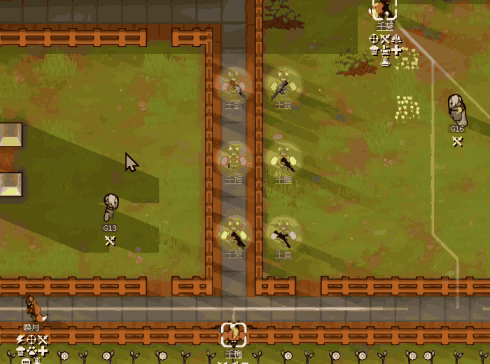
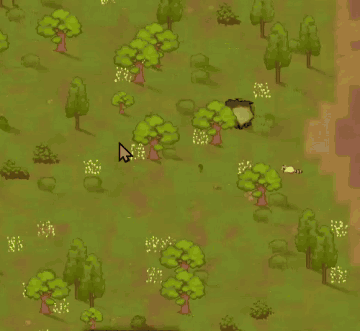

# TakeCover Tweak

RimWorld 1.6 mod. Unofficial control tweak for [TakeCover](https://steamcommunity.com/workshop/filedetails/?id=3749200746), for Company of Heroes-style squad orders.

Steam Workshop: https://steamcommunity.com/sharedfiles/filedetails/?id=3813482936

## Controls

- **Right-drag** with drafted pawns: take cover. No modifier key needed.
- **Right-click without dragging**: vanilla behavior.
- **Ctrl + right-click or right-drag**: fully vanilla.

The press point is the rally point, the drag direction is the enemy direction and the drag length is the total formation width. Destination circles show the cover of each cell (green 50% or more, yellow 20% or more, red below).

**Along a fence**

**In the open**

## Notes

- Requires TakeCover and Harmony. Load after TakeCover.
- Safe to add to or remove from an existing save. Disable it and TakeCover works exactly as before.
- Achtung! is not supported. Combat Extended has not been tested.

## Building

Source is in `Source/`; the built DLL goes to `1.6/Assemblies/`.
